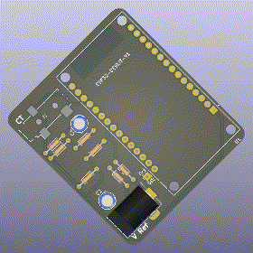
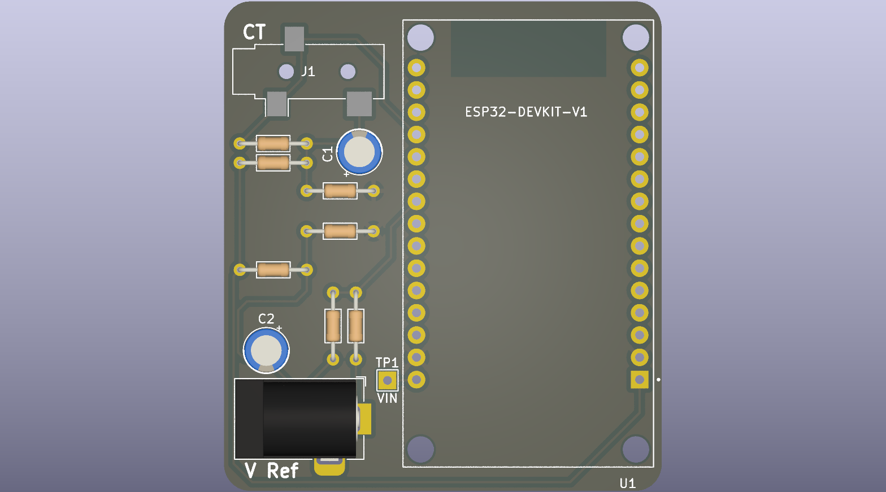
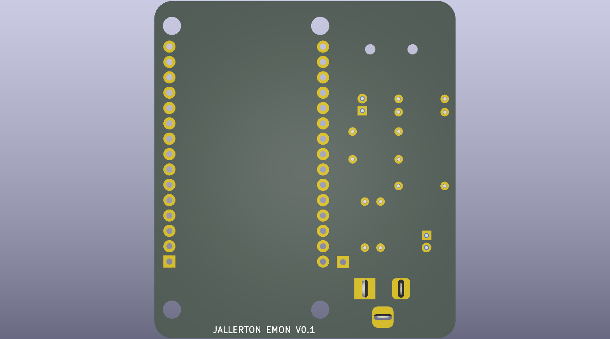

# esp32-emon

A simple energy monitor based off early versions of an energy monitor by openenergymonitor.org.

## Hardware

[PDF Schematic](/hardware/esp32-emon/schematic.pdf)

## Software

The software uses [EmonLib](https://github.com/openenergymonitor/EmonLib) and integrates with HomeAssistant through [ESPHome](https://esphome.io/index.html).
